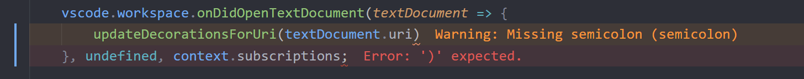

> This is a fork of https://github.com/phindle/error-lens. Changes between this and the original repo should be reflected in the [CHANGELOG](https://github.com/usernamehw/vscode-error-lens/blob/master/CHANGELOG.md) file.

ErrorLens turbo-charges the language diagnostic features, by making diagnostics stand out more prominently, highlighting
the entire line wherever a diagnostic is generated by the language and also prints the diagnostic message(s) in-line at
the site of the line of code which is generating the diagnostic.

## Features

* Highlight lines containing diagnostics.
* Append diagnostic descriptions to the end of the line.
* Show icons in gutter.

## Settings

* `errorLens.useColorContributions`: Use color contributions instead of settings. These Colors can be contributed by themes.
* `errorLens.errorBackground`: Background color of the entire line containing error.
* `errorLens.errorForeground`: Text color used to highlight lines containing errors.
* `errorLens.errorMessageBackground`: Background color of the error message.
* `errorLens.warningBackground`: Background color of the entire line containing warning.
* `errorLens.warningForeground`: Text color used to highlight lines containing warnings.
* `errorLens.warningMessageBackground`: Background color of the warning message.
* `errorLens.infoBackground`: Background color of the entire line containing info.
* `errorLens.infoForeground`: Text color used to highlight lines containing info.
* `errorLens.infoMessageBackground`: Background color of the info message.
* `errorLens.hintBackground`: Background color of the entire line containing hint.
* `errorLens.hintForeground`: Text color used to highlight lines containing hints.
* `errorLens.hintMessageBackground`: Background color of the hint message.
* `errorLens.light`: Overwrite any of the above colors (except `message`) for light themes
* `errorLens.fontSize`: Font size of annotations. **HACK**
* `errorLens.fontFamily`: Font family of annotations. **HACK**
* `errorLens.fontWeight`: Font Weight of annotations.
* `errorLens.fontStyleItalic`: Show ErrorLens annotations in Italics, or not?
* `errorLens.margin`: Distance between the end of the line and the start of annotation. (CSS units)
* `errorLens.enabledDiagnosticLevels`: Customize which diagnostic levels to highlight.
* `errorLens.annotationPrefix`: Specify diagnostic message prefixes (when `addAnnotationTextPrefixes` is true). For example, emoji: ❗ ⚠ ℹ.
* `errorLens.addAnnotationTextPrefixes`: If 'true', prefixes the diagnostic severity ('ERROR:', 'WARNING:' etc) to ErrorLens annotations.
* `errorLens.exclude`: Specify messages that should not be highlighted (RegEx).
* `errorLens.delay`: Specify delay before showing problems.
* `errorLens.onSave`: Update decorations only on document save.
* `errorLens.gutterIconsEnabled`: Show gutter icons (In place of debug breakpoint icon).
* `errorLens.gutterIconSize`: Customize gutter icon size. Example: `"120%"`
* `errorLens.gutterIconSet`: Customize gutter icon style. Possible values: `"default"`, `"defaultOutline"`, `"borderless"`, `"circle"`.
* `errorLens.errorGutterIconPath`: Set custom icons for gutter. Absolute path for error gutter icon.
* `errorLens.warningGutterIconPath`: Set custom icons for gutter. Absolute path for warning gutter icon.
* `errorLens.infoGutterIconPath`: Set custom icons for gutter. Absolute path for info gutter icon.
* `errorLens.errorGutterIconColor`: Error color of the `circle` gutter icon set.
* `errorLens.warningGutterIconColor`: Warning color of the `circle` gutter icon set.
* `errorLens.infoGutterIconColor`: Info color of the `circle` gutter icon set.
* `errorLens.followCursor`: Highlight only portion of the problems. Possible values: `"allLines"`, `"activeLine"`, `"closestProblem"`.
* `followCursorMore`: Augments `followCursor`. Adds number of lines to top and bottom when `followCursor` is `activeLine`. Adds number of closest problems when `followCursor` is `closestProblem`

## Commands

* `errorLens.toggle` Temporarily Enable/Disable ErrorLens.
* `errorLens.toggleError` Temporarily Enable/Disable Error level.
* `errorLens.toggleWarning` Temporarily Enable/Disable Warning level.
* `errorLens.toggleInfo` Temporarily Enable/Disable Info level.
* `errorLens.toggleHint` Temporarily Enable/Disable Hint level.
* `errorLens.copyProblemMessage` Copy problem message to clipboard (at the active line).

## Colors (works only when `useColorContributions` setting is true)

Can be configured in `settings.json` (**`workbench.colorCustomizations`** section)

* `errorLens.errorBackground`
* `errorLens.errorMessageBackground`
* `errorLens.errorForeground`
* `errorLens.warningBackground`
* `errorLens.warningMessageBackground`
* `errorLens.warningForeground`
* `errorLens.infoBackground`
* `errorLens.infoMessageBackground`
* `errorLens.infoForeground`
* `errorLens.hintBackground`
* `errorLens.hintMessageBackground`
* `errorLens.hintForeground`

## [Miscellaneous: `misc.md`](https://github.com/usernamehw/vscode-error-lens/blob/master/misc.md)
