<!--
"window.zoomLevel": 0.9,// & 1.9
"workbench.colorTheme": "Prism",
"editor.rulers": [40, 80, 120, 130],
-->

### Real talk: this is one of the most annoying extensions out there. Unless you are learning to code, I recommend keeping the inline message disabled by default and binding a hotkey to toggle it:

```js
// keybindings.json
{
    "key": "ctrl+u",
    "command": "errorLens.toggleInlineMessage",
    //          ^ Toggles global setting `errorLens.messageEnabled`
},
```

### If you don't want to go with the hotkey route - it's possible to:

1) Exclude problems (in workspace, by source, by code, by message)
1) Show fewer decorations (render decoration only on the active line)
1) Delay showing decorations (delay ms / on document save)
1) Transform problem message (make it shorter maybe)
1) Configure other settings or colors to make it less distracting

### 1. Exclude problems:

```js
"errorLens.exclude": [
    "Missing semicolon",
    "Newline required at end of file but not found",
    "More than 1 blank line not allowed",
],
// OR
"errorLens.excludeBySource": [
    "eslint(padded-blocks)",
],
```

### 2. Show only active line decoration or closest problem:

```js
"errorLens.followCursor": "activeLine",
// OR
"errorLens.followCursor": "closestProblem",
```

### 3. Delay showing problems:

```js
"errorLens.delay": 1500,
// OR
"errorLens.onSave": true,
```

### 4. Transform problem message:

<table>
<tbody>
<tr>
<td>

```js
"errorLens.replace": [
    {
        "matcher": "is declared but its value is never read",
        "message": "ಠ╭╮ಠ",
    },
],
```

</td>
<td>


</td>
</tr>
</tbody>
</table>

---

## Settings (70+)

### `errorLens.enabled`

Toggle all decorations and features (background highlighting, inline message, gutter icons, status bar message, code lens).
Extension adds a command to toggle this setting: `errorLens.toggle` **Error Lens: Toggle (Enable/Disable) Everything**

### `errorLens.respectUpstreamEnabled`

Disable decorations or features when VSCode setting `problems.visibility` ("Controls whether the problems are visible throughout the editor and workbench") is disabled.

### `errorLens.enabledInMergeConflict`

Disable decorations when file has merge conflict symbols `<<<<<<<` or `=======` or `>>>>>>>`.

### `errorLens.fontFamily`

Change font family of inline message. Not supported natively by VSCode. Non-monospace fonts can usually fit more characters in the same space. May break [errorLens.alignMessage](#errorlensalignmessage).

<table>
<tbody>

<!-- ──────────────────────────────────────────────────────────── -->
<tr>
<th>""</th>
<td>

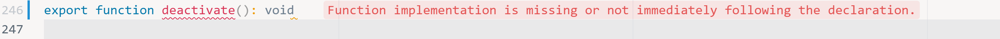

</td>
</tr>
<!-- ──────────────────────────────────────────────────────────── -->
<tr>
<th>"Arial"</th>
<td>

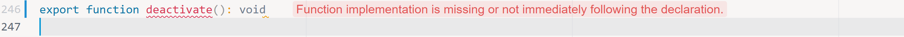

</td>
</tr>
<!-- ──────────────────────────────────────────────────────────── -->
<tr>
<th>"Times"</th>
<td>


</td>
</tr>
<!-- ──────────────────────────────────────────────────────────── -->
<tr>
<th>"Helvetica"</th>
<td>

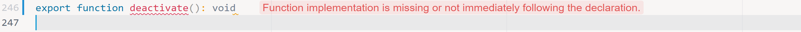

</td>
</tr>
<!-- ──────────────────────────────────────────────────────────── -->
<tr>
<th>"Gabriola"</th>
<td>

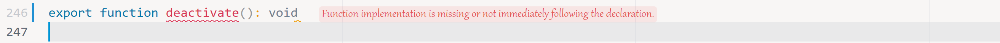

</td>
</tr>
<!-- ──────────────────────────────────────────────────────────── -->
<tr>
<th>"Calibri"</th>
<td>

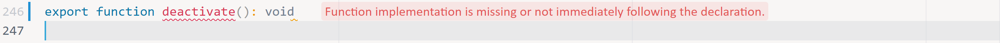

</td>
</tr>
<!-- ──────────────────────────────────────────────────────────── -->
<tr>
<th>"Comic Sans MS"</th>
<td>

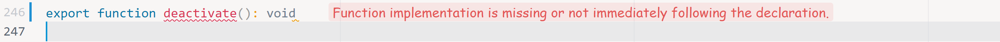

</td>
</tr>
<!-- ──────────────────────────────────────────────────────────── -->
<tr>
<th>"Cascadia Code"</th>
<td>

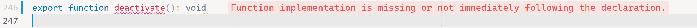

</td>
</tr>
<!-- ──────────────────────────────────────────────────────────── -->
<tr>
<th>"Segoe Print"</th>
<td>

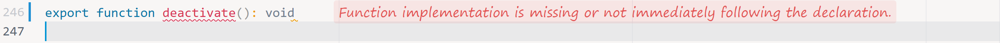

</td>
</tr>
<!-- ──────────────────────────────────────────────────────────── -->

</tbody>
</table>

### `errorLens.fontWeight`

Whether to use bold or not font weight for messages.

<table>
<tbody>
<tr>
<th align="center">"normal"</th>
<th align="center">"bold"</th>
</tr>
<tr>
<td>

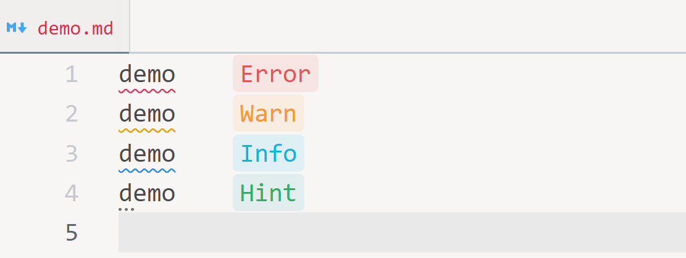

</td>

<td>

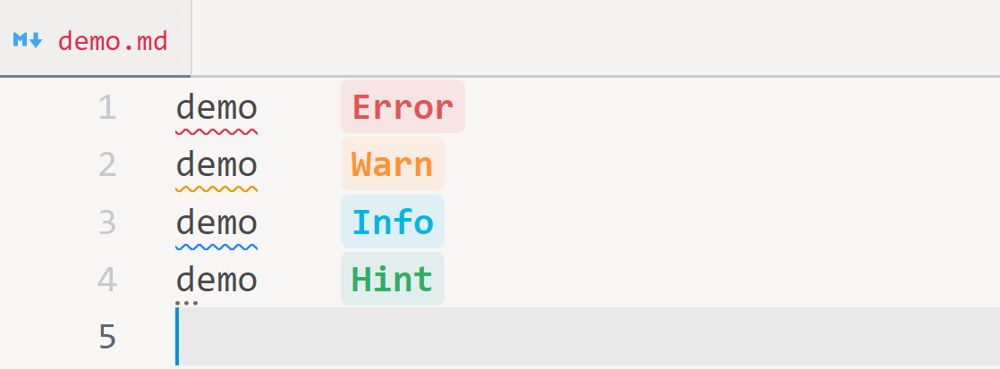

</td>

</tr>
</tbody>
</table>

### `errorLens.fontStyleItalic`

Whether to use italic font style or not for messages.

<table>
<thead>
<tr>
<th align="center">false</th>
<th align="center">true</th>
</tr>
</thead>
<tbody>
<tr>
<td>

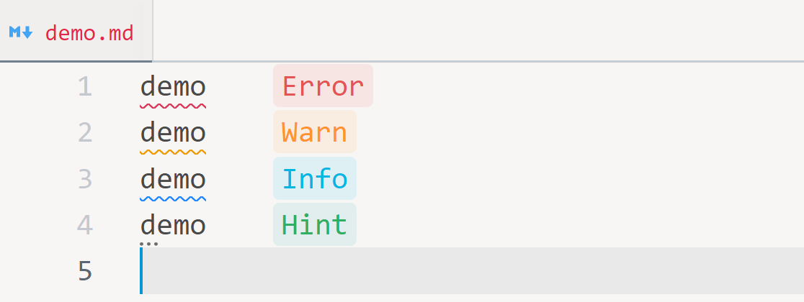

</td>

<td>

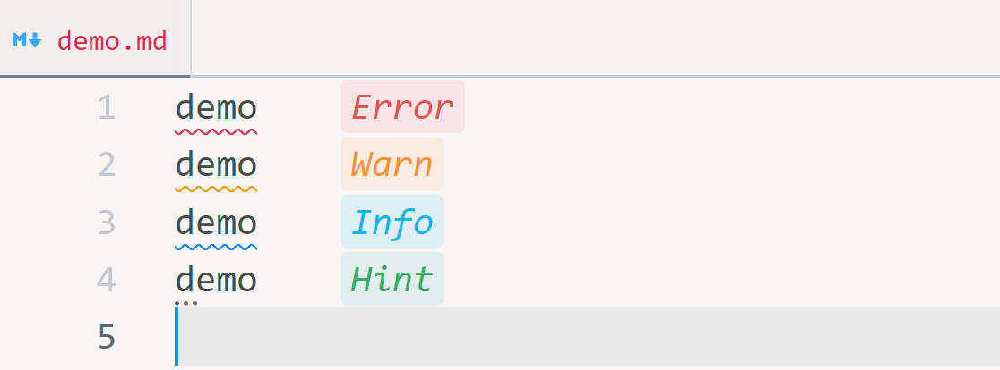

</td>

</tr>
</tbody>
</table>

### `errorLens.fontSize`

Change font size of inline message. Not supported natively by VSCode. Mostly useful to make message smaller, not bigger. May break [errorLens.alignMessage](#errorlensalignmessage).

<table>
<tbody>

<tr>
<th>""</th>
<td>

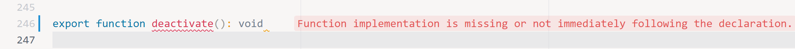

</td>
</tr>

<tr>
<th>"12px"</th>
<td>

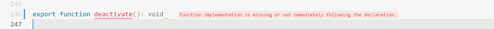

</td>
</tr>

</tbody>
</table>


### `errorLens.margin`

Extra space between the end of the line (end of text) and the inline message.

<table>
<thead>
<tr>
<th align="center">"4ch"</th>
<th align="center">"0"</th>
<th align="center">"100px"</th>
</tr>
</thead>
<tbody>
<tr>
<td>

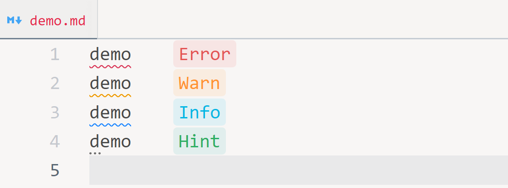

</td>

<td>

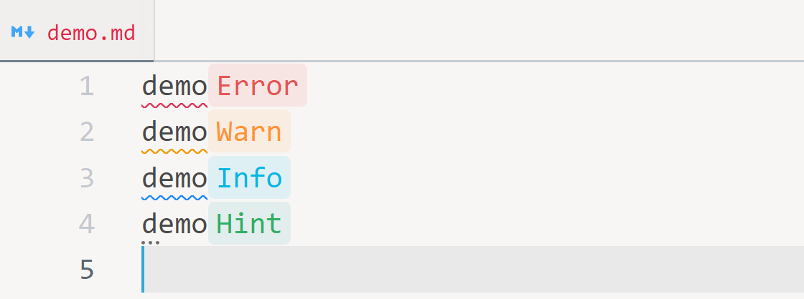

</td>

<td>

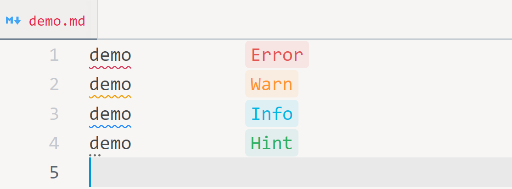

</td>

</tr>
</tbody>
</table>

### `errorLens.alignMessage`

Align message to be in the same column (if possible). Only works with monospace fonts.

<table>
<tbody>

<tr>
<td>

```js
"errorLens.alignMessage": {
    "start": 40,
    "end": 0,
    "padding": [0, 0.5],
},
```

</td>
<td>


</td>
</tr>

<tr>
<td>

```js
"errorLens.alignMessage": {
    "start": 0,
    "end": 80,
    "padding": [0, 0.5],
},
```

</td>
<td>

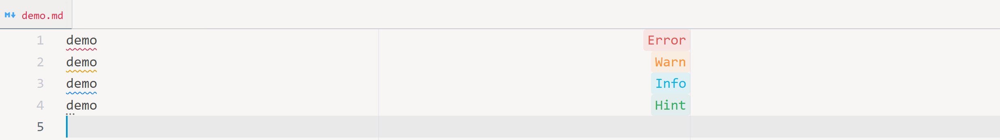

</td>
</tr>

</tbody>
</table>

### `errorLens.border`

<table>
<tbody>

<tr>
<td>

```js
"errorLens.border": [
	"1px solid",
	"1px dotted",
	"1px dashed",
	"1px solid #00000040",
],
```

</td>
<td>

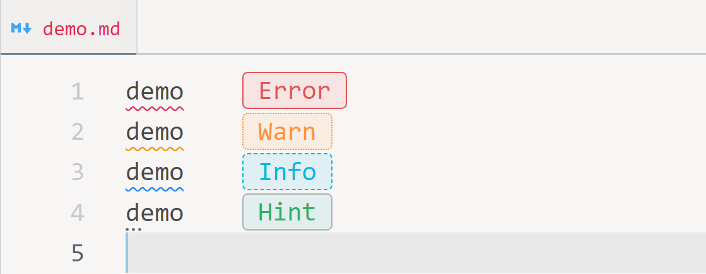

</td>
</tr>

</tbody>
</table>

### `errorLens.padding`

Add space around the inline message. Only visible when [errorLens.messageBackgroundMode](#errorlensmessagebackgroundmode) is set to `message`.

<table>
<tbody>
<tr>
<th align="center">"0"</th>
<th align="center">"2px 0.5ch"</th>
</tr>
<tr>
<td>

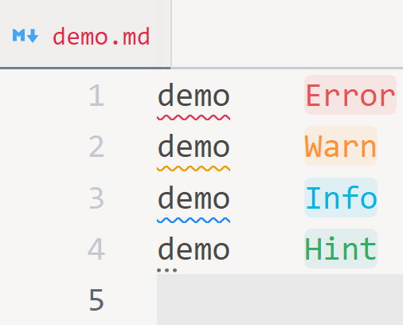

</td>

<td>

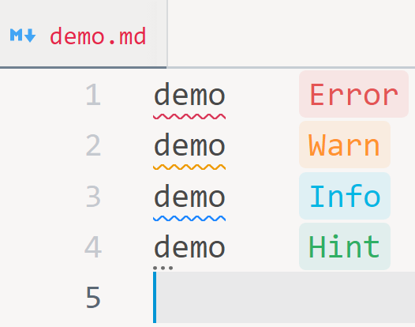

</td>

</tr>
</tbody>
</table>

### `errorLens.borderRadius`

Round corners for inline message. Only visible when [errorLens.messageBackgroundMode](#errorlensmessagebackgroundmode) is set to `message`.

<table>
<thead>
<tr>
<th align="center">"0.3em"</th>
<th align="center">"0"</th>
<th align="center">"50%"</th>
<th align="center">"10px 30px 10px 30px"</th>
</tr>
</thead>
<tbody>
<tr>
<td>

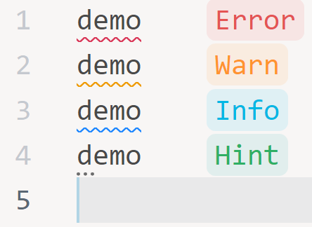

</td>

<td>

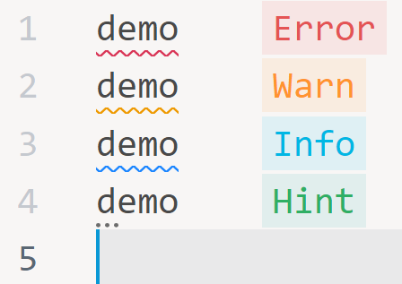

</td>

<td>

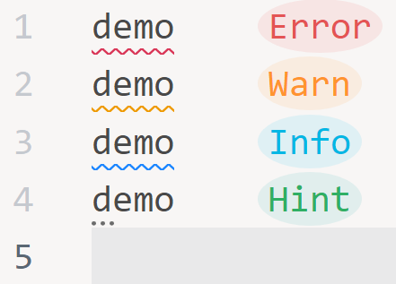

</td>

<td>

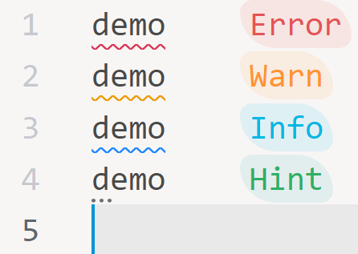

</td>

</tr>
</tbody>
</table>

### `errorLens.enabledDiagnosticLevels`

Controls which diagnostics to include (error/warning/info/hint) for all features of this extension (decorations, gutter, status bar, code lens,...).

<table>
<thead>
<tr>
<th align="center">["error", "warning", "info", "hint"]</th>
<th align="center">["error", "warning"]</th>
<th align="center">["error", "info"]</th>
</tr>
</thead>
<tbody>
<tr>
<td>

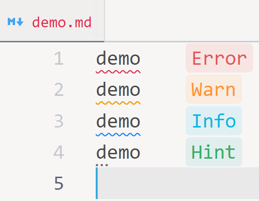

</td>

<td>


</td>

<td>

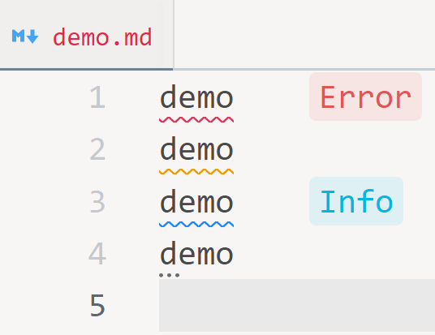

</td>

</tr>
</tbody>
</table>

### `errorLens.messageTemplate`

Template used for all inline messages. Possible variables:

- `$message` - diagnostic message text
- `$count` - Number of diagnostics on the line
- `$severity` - Severity prefix taken from [errorLens.severityText](#errorlensseveritytext)
- `$source` - Source of diagnostic e.g. \"eslint\"
- `$code` - Code of the diagnostic

<table>
<tbody>

<tr>
<td>

```js
"errorLens.messageTemplate": "[$count] $severity $message $source($code)",
```

</td>
</tr>

<tr>
<td>

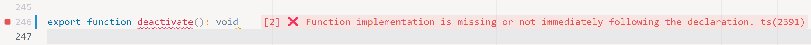

</td>
</tr>

</tbody>
</table>

### `errorLens.messageMaxChars`

<table>
<tbody>

<tr>
<th align="center">500</th>
<td>

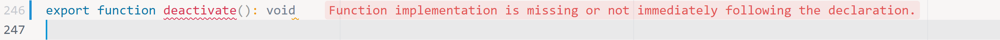

</td>
</tr>

<tr>
<th align="center">50</th>
<td>

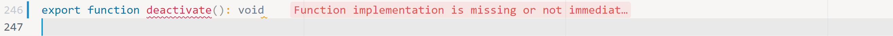

</td>

</tr>
</tbody>
</table>

### `errorLens.severityText`

Replaces `$severity` variable in [errorLens.messageTemplate](#errorlensmessagetemplate).

<table>
<tbody>

<tr>
<td>

```js
"errorLens.messageTemplate": "$severity $message",
"errorLens.severityText": [
    "❌",
    "⚠",
    "ℹ",
    "📗",
],
```

</td>
<td>

```js
"errorLens.messageTemplate": "$severity $message",
"errorLens.severityText": [
    "■",
    "■",
    "■",
    "■",
],
```

</td>
</tr>

<tr>
<td>

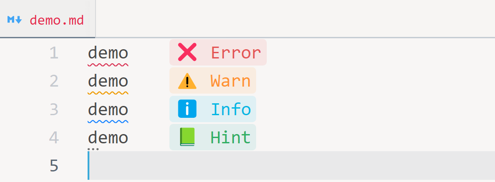

</td>

<td>

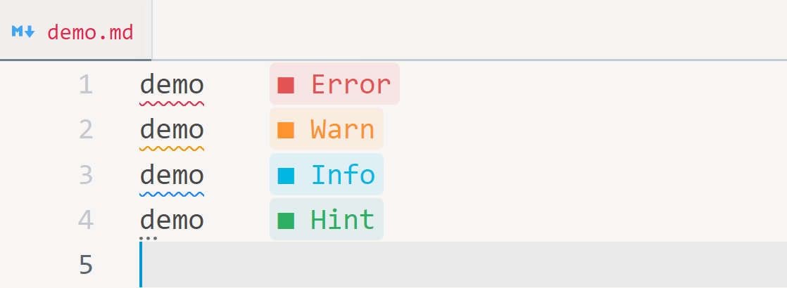

</td>
</tr>

<tr>
<td>

```js
"errorLens.messageTemplate": "$severity $message",
"errorLens.severityText": [
    "▣",
    "◈",
    "◉",
    "⛆",
],
```

</td>
<td>

```js
"errorLens.messageTemplate": "$severity$message",
"errorLens.severityText": [
    "ERROR: ",
    "WARNING: ",
    "",
    "",
],
```

</td>
</tr>

<tr>
<td>

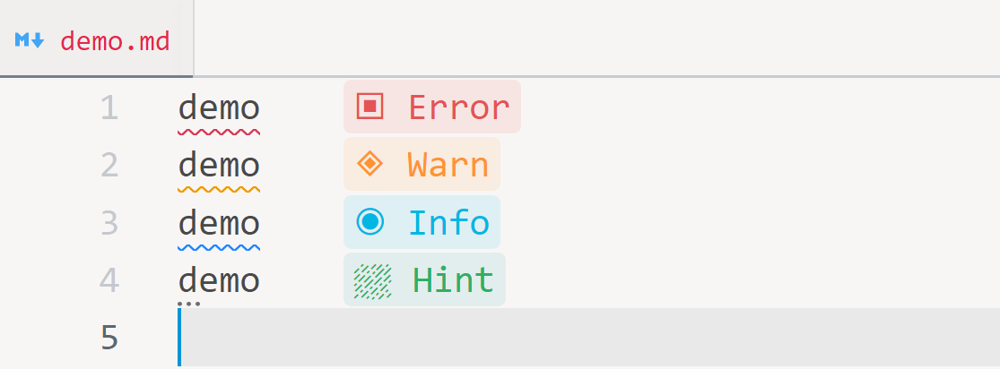

</td>

<td>

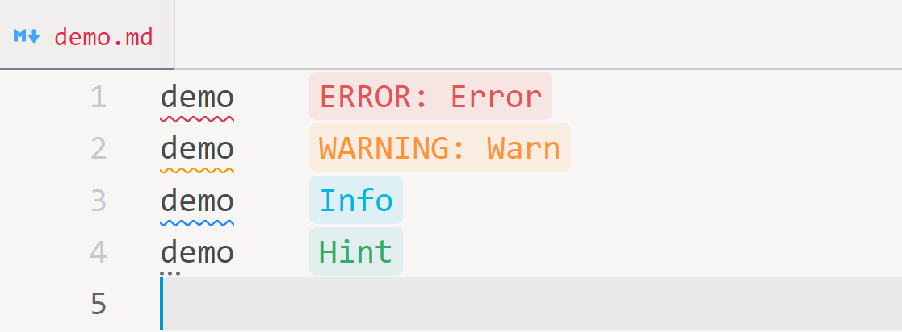

</td>
</tr>

</tbody>
</table>

### `errorLens.messageEnabled`

Controls visibility of inline message (including background highlighting). Doesn't include gutter icons.

<table>
<tbody>

<tr>
<th>true</th>
<th>false</th>
</tr>

<tr>
<td>

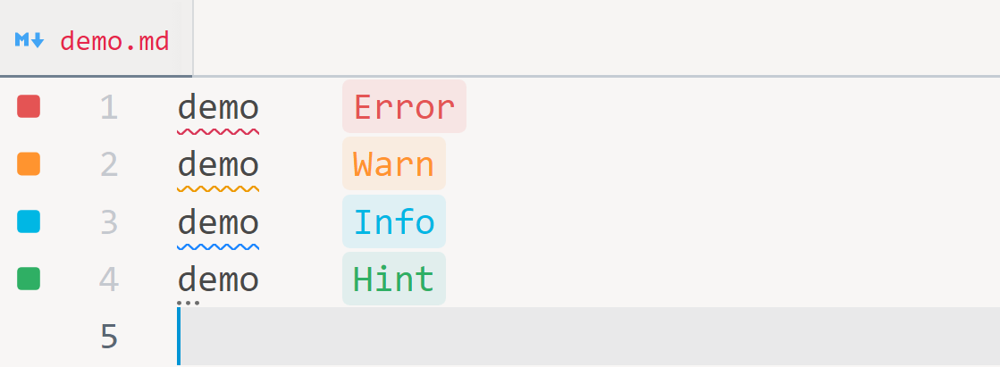

</td>
<td>

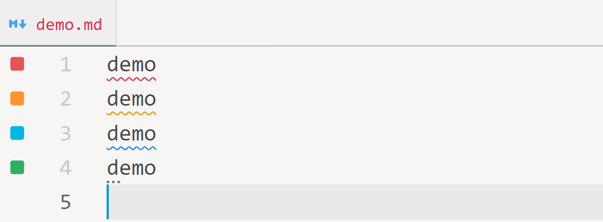

</td>
</tr>

<tr>


</tr>
</tbody>
</table>

### `errorLens.messageBackgroundMode`

<table>
<thead>
<tr>
<th align="center">"line"</th>
<th align="center">"message"</th>
<th align="center">"none"</th>
</tr>
</thead>
<tbody>
<tr>
<td>

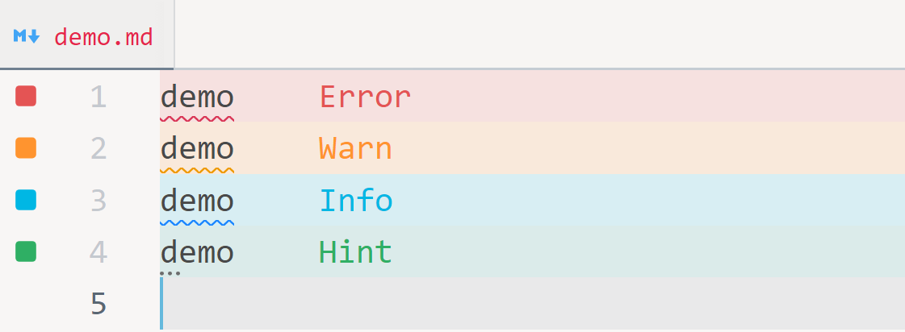

</td>

<td>


</td>

<td>

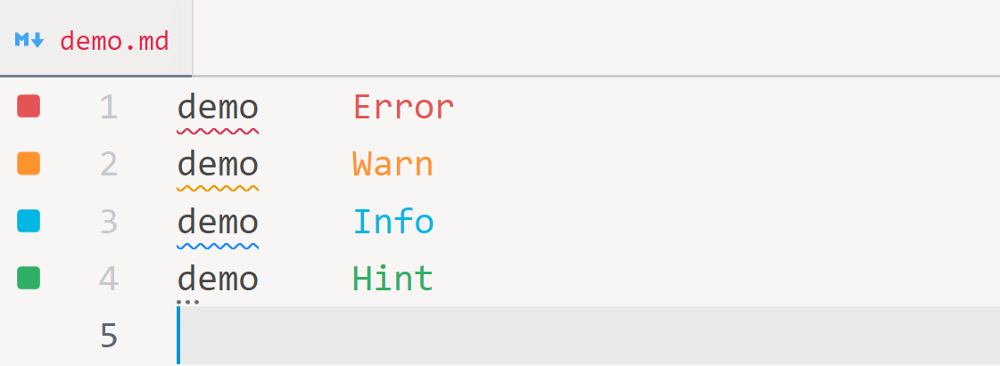

</td>

</tr>
</tbody>
</table>

### `errorLens.problemRangeDecorationEnabled`

VSCode now supports natively highlighting problem ranges even without this exntension (except `hint` severity):

<table>
<tbody>
<tr>
<td>

```js
"workbench.colorCustomizations": {
    "editorError.background": "#ff000030",
    "editorWarning.background": "#ee990030",
    "editorInfo.background": "#0095d530",
},
```

</td>
<td>

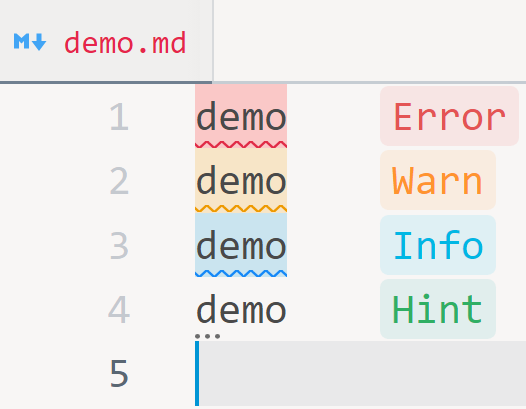

</td>
</tr>

</tbody>
</table>


Still, it might be useful if you decide to disable native error highlighting and use the one from this extension (after delay or use different highlighting methods like borders):

<table>
<tbody>
<tr>
<td>

```js
"workbench.colorCustomizations": {
    "editorError.foreground": "#fff0",
    "editorWarning.foreground": "#fff0",
    "editorInfo.foreground": "#fff0",
    "editorHint.foreground": "#fff0",
},

"errorLens.problemRangeDecorationEnabled": true,

"errorLens.decorations": {
    "errorRange": {
        "border": "1px dashed red",
        "backgroundColor": "#ff000090",
        "color": "#ffffff",
    },
    "warningRange": {
        "border": "2px dotted #fa9121",
    },
    "infoRange": {
        "textDecoration": ";background:linear-gradient(45deg,#ff8400,#00d9ff);background-clip:text;color:transparent;border-bottom:2px solid #00d9ff",
        "backgroundColor": "#fff0",
    },
    "hintRange": {
        "textDecoration": ";box-shadow:0 0 5px 3px #2faf6470;border-radius:0.25em",
    },
},
```

</td>
</tr>

<tr>
<td>

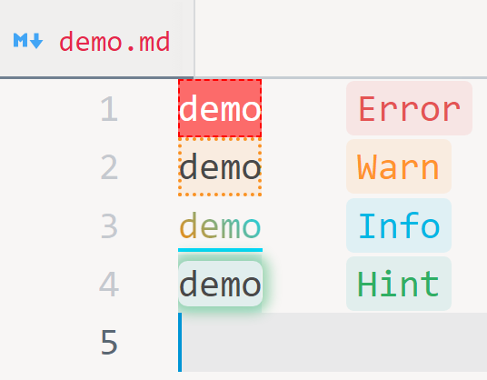

</td>
</tr>

</tbody>
</table>

### `errorLens.editorHoverPartsEnabled`

Controls which parts of hover are enabled (for the text editor; Doesn't affect status bar message hover).

- `messageEnabled` - Shows problem message.
- `sourceCodeEnabled` Shows prblem `source` & `code` and buttons to copy them to the clipboard
- `buttonsEnabled` - Show buttons like `Exclude`, `Open Definition`, `Search`...

### `errorLens.statusBarIconsEnabled`

Show icons for Errors & Warnings in status bar similar to native ones, but with the ability to change color / background color.

<table>
<tbody>

<tr>
<td>

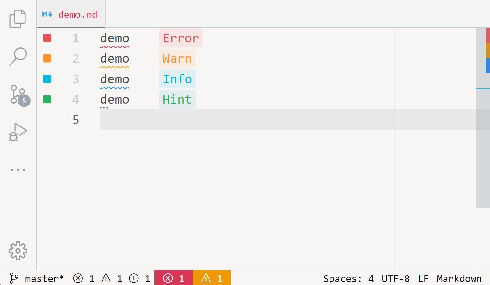

</td>
<td>

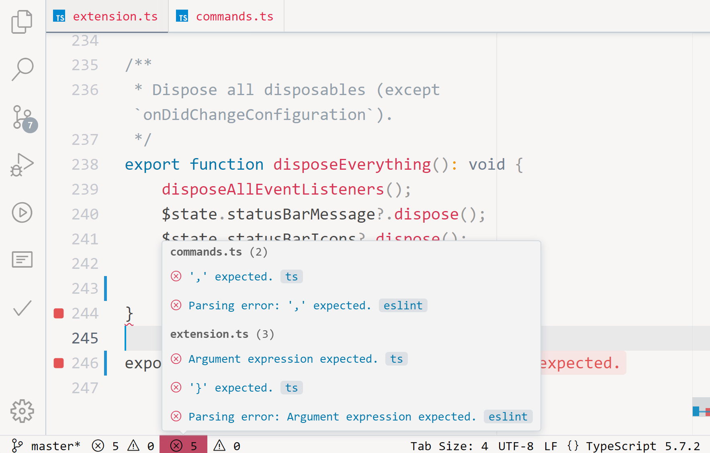

</td>
</tr>

<tr>


</tr>
</tbody>
</table>

### `errorLens.statusBarIconsPriority`

Move status bar icons right/left.

### `errorLens.statusBarIconsAlignment`

Choose alignment of the status bar icons left/right side of the viewport.

### `errorLens.statusBarIconsTargetProblems`

Choose what to include in counters for problems (status bar icons).

### `errorLens.statusBarIconsUseBackground`

When enabled - highlight status bar with background colors. Only 2 VSCode colors allowed (`statusBarItem.errorBackground` & `statusBarItem.warningBackground`).

### `errorLens.statusBarIconsAtZero`

Choose what happens to status bar icons when there are no errors - hide or remove background color.

### `errorLens.statusBarMessageEnabled`

Show problem message in Status Bar.

<table>
<tbody>

<tr>
<td>

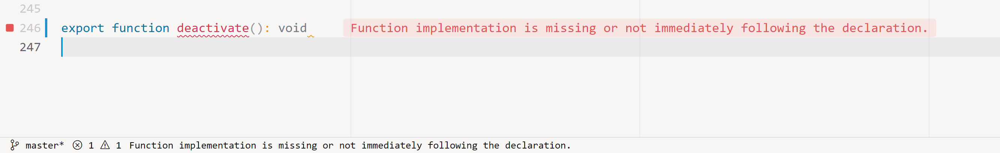

</td>
</tr>

<tr>
<td>

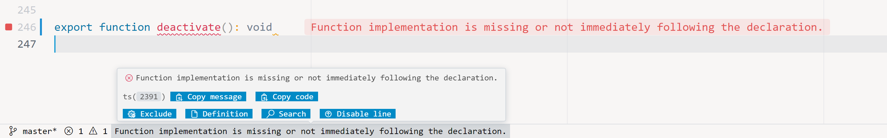

</td>
</tr>

</tbody>
</table>

Show problem message in Status Bar.

### `errorLens.statusBarMessageType`

Choose which diagnostic to use for status bar message:

- `closestProblem` - Closest to the cursor diagnostic
- `closestSeverity` - Closest to the cursor diagnostic sorted by severity (e.g. error will be shown before warning even if it's farther from the cursor)
- `activeLine` - Show only diagnostic that is on the same line as the cursor
- `activeCursor` - Similar to `activeLine` but follows the cursor movement inside the line

### `errorLens.statusBarMessagePriority`

Move status bar icons right/left.

### `errorLens.statusBarMessageAlignment`

Choose alignment of the status bar message left/right side of the viewport.

### `errorLens.statusBarColorsEnabled`

Uses colors `errorLens.statusBarErrorForeground`, `errorLens.statusBarWarningForeground`, `errorLens.statusBarInfoForeground`, `errorLens.statusBarHintForeground`.

<table>
<tbody>

<tr>
<th>false</th>
<td>

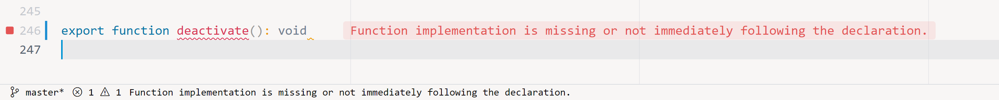

</td>
</tr>

<tr>
<th>true</th>
<td>

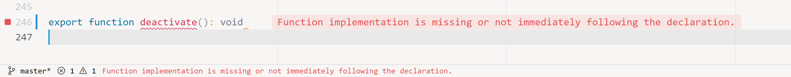

</td>

</tr>
</tbody>
</table>


────────────────────────────────────────────────────────────

### `errorLens.statusBarCommand`

Command that executes on click for Status Bar.

### `errorLens.statusBarMessageTemplate`

Almost the same as [errorLens.messageTemplate](#errorlensmessagetemplate) but instead affects status bar message.

### `errorLens.replace`

Replace message with custom one. Uses strings to create RegExp with `iu` flags.

<table>
<tbody>

<tr>
<td>

```js
"errorLens.replace": [],
```

</td>
<td>

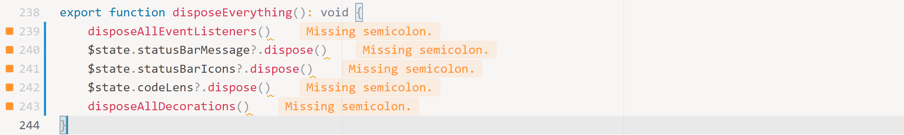

</td>
</tr>
<!-- ──────────────────────────────────────────────────────────── -->
<tr>
<td>

```js
"errorLens.replace": [
    {
        "matcher": "Missing semicolon",
        "message": ";",
    },
],
```

</td>
<td>

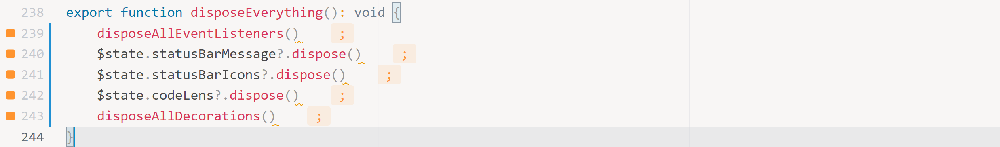

</td>
</tr>
<!-- ──────────────────────────────────────────────────────────── -->
<tr>
<td>

```js
"errorLens.replace": [],
```

</td>
<td>

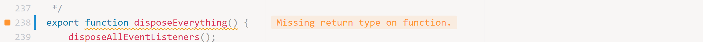

</td>
</tr>
<!-- ──────────────────────────────────────────────────────────── -->
<tr>
<td>

```js
"errorLens.replace": [
    {
        "matcher": "Missing return type on (.+)",
        "message": "Type $1"
    }
],
```

</td>
<td>

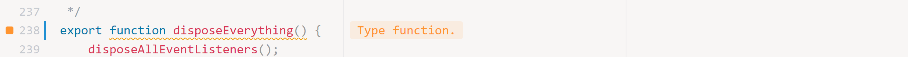

</td>
</tr>
<!-- ──────────────────────────────────────────────────────────── -->
<tr>
<td>

```js
"errorLens.replace": [
    {
        "matcher": "Missing return type on",
        "message": "<==",
    },
],
```

</td>
<td>

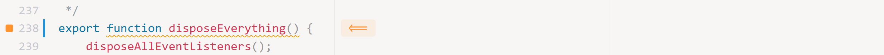

</td>
</tr>
<!-- ──────────────────────────────────────────────────────────── -->
<tr>
<td>

```js
"errorLens.replace": [
    {
        "matcher": "Missing return type on",
        "message": "(。_。)",
    },
],
```

</td>
<td>

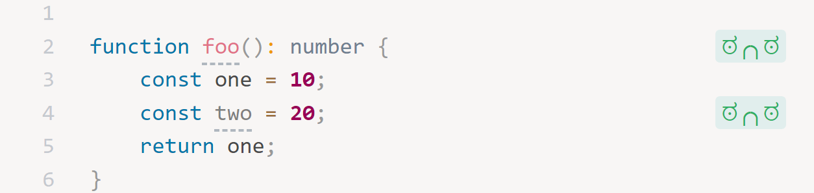

</td>
</tr>
<!-- ──────────────────────────────────────────────────────────── -->

</tbody>
</table>

### `errorLens.exclude`

Exclude diagnostics by message. Uses strings to create RegExp with `iu` flags.

### `errorLens.excludeBySource`

Exclude diagnostics by source or source+code pair.

### `errorLens.excludePatterns`

Exclude files by using [glob](https://code.visualstudio.com/docs/editor/glob-patterns) pattern (VSCode flavor. May have differences like [Glob matching should be case insensitive Issue#10633](https://github.com/Microsoft/vscode/issues/10633)). Example `[\"**/*.{ts,js}\"]`.

### `errorLens.excludeWorkspaces`

Exclude the entire workspace from highlighting problems. Related Command: `errorlens.toggleWorkspace` .

### `errorLens.disableLineComments`

Used for `errorLens.disableLine` command that adds a comment disabling linter rule for a line.

To force comment on the same line - add `SAME_LINE` to the message: `"eslint": "// eslint-disable-line $code SAME_LINE"`

### `errorLens.lintFilePaths`

Specify where to search for linter rule definitions by diagnostic source ([glob](https://code.visualstudio.com/docs/editor/glob-patterns) for local linter files). `node_modules` folder is excluded. Used when running `errorLens.findLinterRuleDefinition` command.

### `errorLens.searchForProblemQuery`

Pick query to open in default browser when searching for problem with `errorLens.searchForProblem` command.

### `errorLens.selectProblemType`

Which problem to select (closest / active line) when executing `errorLens.selectProblem` command.

- `closestProblem`, - Show closest to the cursor diagnostic
- `closestSeverity` - Show closest to the cursor diagnostic (sorted by severity e.g. error will be shown before warning even if it's farther from the cursor)
- `activeLine` - Show only diagnostic that is on the same line as the cursor.

### `errorLens.light`

Override colors when on of the "light" themes is used. Only for colors that are specified in "settings", not in "colors".

### `errorLens.delay`

Wait this amount (in milliseconds) before showing decorations.

### `errorLens.delayMode`

- `new` - Old/stale problems should disappear immediately while new problems should respect [errorLens.delay](#errorlensdelay)
- `old` - Buggy/Overcomplicated old implementation
- `debounce` - Simply use `debounce()` from `Lodash` library. Old/fixed problems also wait [errorLens.delay](#errorlensdelay) ms before being hidden.

### `errorLens.onSave`

When enabled - updates decorations only on document save (manual, not auto save).

### `errorLens.onSaveTimeout`

Wait this much (ms) before showing decorations after the document save.

### `errorLens.onSaveUpdateOnActiveEditorChange`

Update decorations immediately or not when switching focus from one Text Editor to another.

### `errorLens.enableOnDiffView`

Whether or not to show decorations on `diff` editor.

<table>
<tbody>

<tr>
<th>false</th>
<td>

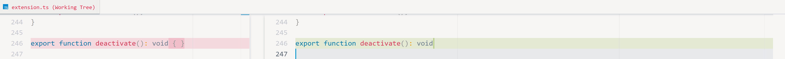

</td>
</tr>

<tr>
<th>true</th>
<td>

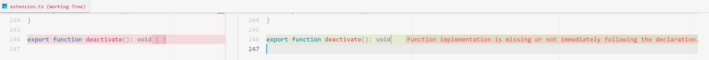

</td>

</tr>
</tbody>
</table>

### `errorLens.followCursor`

Highlight only closest to the cursor problem:

<table>
<tbody>

<tr>
<th align="center">"allLines"</th>
<td>

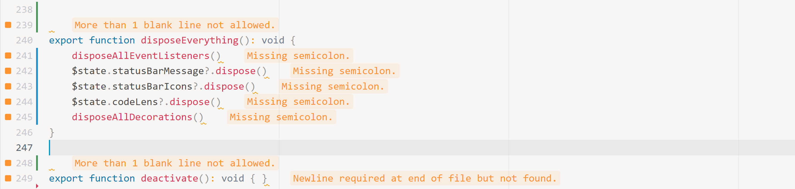

</td>
</tr>

<tr>
<th align="center">"activeLine"</th>
<td>

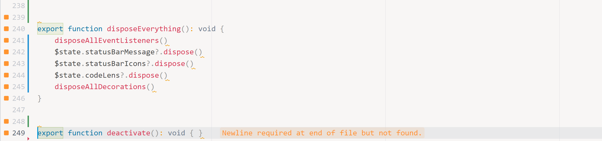

</td>
</tr>

<tr>
<th align="center">"closestProblem"</th>
<td>

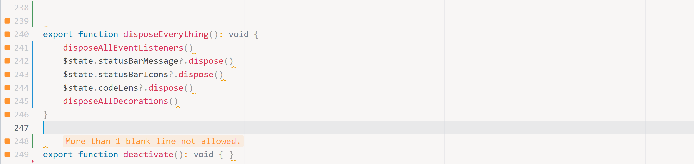

</td>
</tr>

<tr>
<th align="center">"allLinesExceptActive"</th>
<td>

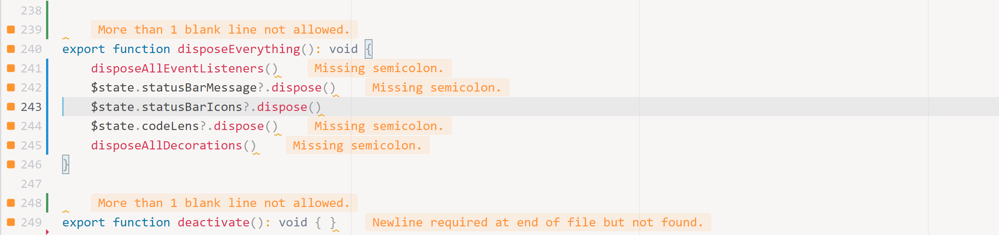

</td>
</tr>

</tbody>
</table>

### `errorLens.followCursorMore`

Augments [errorLens.followCursor](#errorlensfollowcursor) Adds number of lines to top and bottom when `errorLens.followCursor` is set to `activeLine`. Adds number of closest problems when `errorLens.followCursor` is set to `closestProblem`.

<table>
<tbody>

<tr>
<th align="center">0</th>
<td>

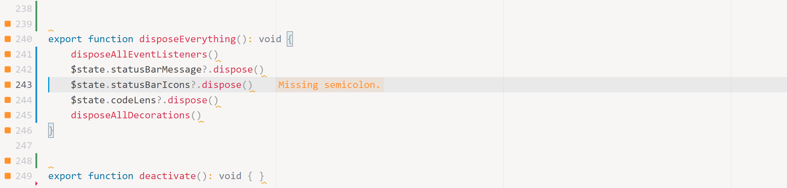

</td>
</tr>

<tr>
<th align="center">1</th>
<td>

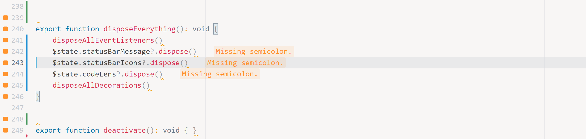

</td>
</tr>

</tbody>
</table>

### `errorLens.gutterIconsEnabled`

Whether to show gutter icons or not.

<table>
<tbody>
<tr>
<th align="center">false</th>
<th align="center">true</th>
</tr>
<tr>
<td>

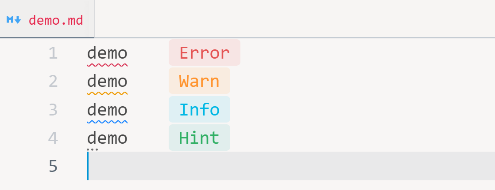

</td>

<td>

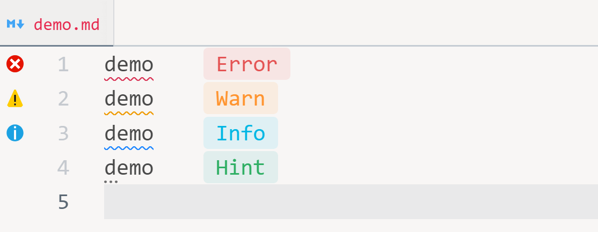

</td>

</tr>
</tbody>
</table>

### `errorLens.gutterIconsFollowCursorOverride`

When enabled and [errorLens.followCursor](#errorlensfollowcursor) setting is not set to `allLines`, then gutter icons would be rendered for all problems. This setting can overcome that:

<table>
<tbody>

<tr>
<td>

```js
"errorLens.gutterIconsEnabled": true,
"errorLens.followCursor": "activeLine",
"errorLens.gutterIconsFollowCursorOverride": true,
```

</td>
<td>

```js
"errorLens.gutterIconsEnabled": true,
"errorLens.followCursor": "activeLine",
"errorLens.gutterIconsFollowCursorOverride": false,
```

</td>
</tr>

<tr>
<td>

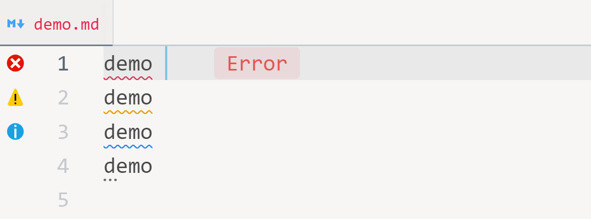

</td>

<td>

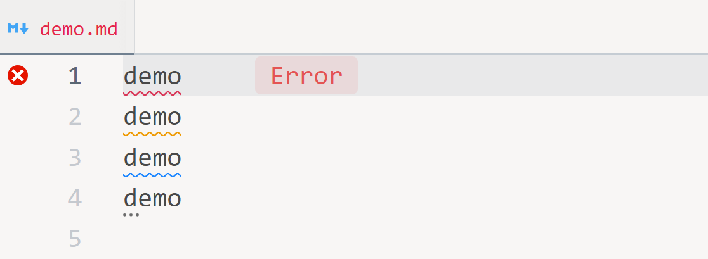

</td>

</tr>
</tbody>
</table>

### `errorLens.gutterIconSize`

Change size of gutter icons:

<table>
<thead>
<tr>
<th align="center">"100%"</th>
<th align="center">"70%"</th>
<th align="center">"150%"</th>
</tr>
</thead>
<tbody>
<tr>
<td>

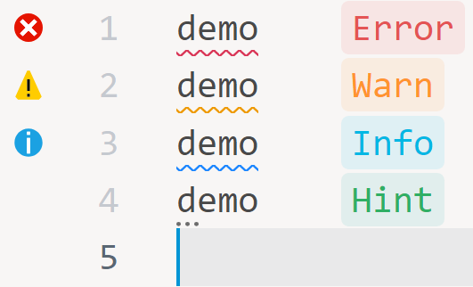

</td>

<td>

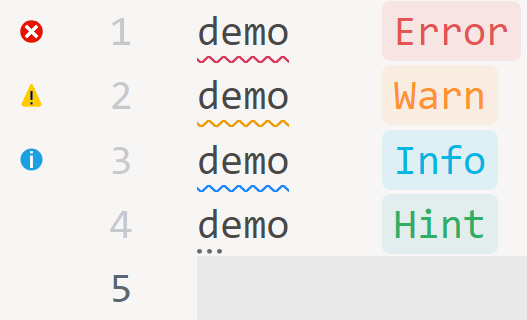

</td>

<td>

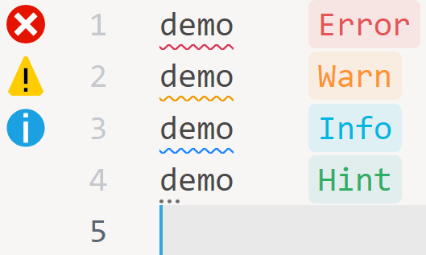

</td>

</tr>
</tbody>
</table>

### `errorLens.gutterIconSet`

<table>
<tbody>

<tr>
<th>"default"</th>
<th>"circle"</th>
</tr>

<tr>
<td>

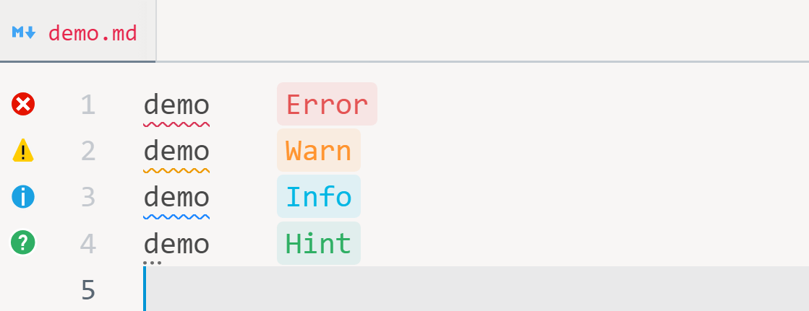

</td>

<td>

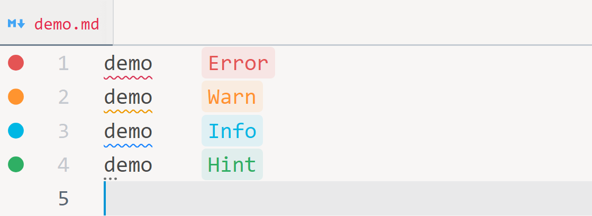

</td>
</tr>

<tr>
<th>"squareRounded"</th>
<th>"letter"</th>
</tr>

<tr>
<td>

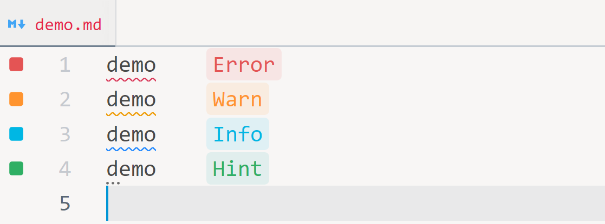

</td>

<td>

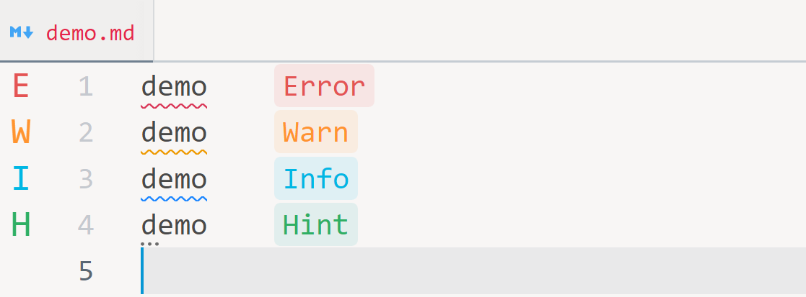

</td>
</tr>

<tr>
<th>"emoji"</th>
<th></th>
</tr>

<tr>
<td>


</td>

<td>

</td>
</tr>

</tbody>
</table>

### `errorLens.gutterEmoji`

Control image shown in gutter when [errorLens.gutterIconSet](#errorlensguttericonset) is `"emoji"`. Can use other utf-8 symbols like ♞/⚃/⛆/★/▣/◈/... Possible to fit 2 symbols that are not as wide as emoji.

<table>
<tbody>
<tr>
<td>

```js
"errorLens.gutterEmoji": {
    "error": "🍎",
    "warning": "🍊",
    "info": "⟁",
    "hint": ":(",
},
```

</td>

<td>

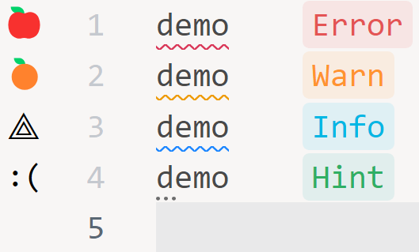

</td>

</tr>
</tbody>
</table>

### `errorLens.errorGutterIconPath`

Set custom icons for gutter.

<table>
<tbody>
<tr>
<td>

```js
"errorLens.errorGutterIconPath": "C:\\temp\\Stop.png",
"errorLens.warningGutterIconPath": "C:\\temp\\Warning.png",
"errorLens.infoGutterIconPath": "C:\\temp\\vscode.png",
"errorLens.hintGutterIconPath": "C:\\temp\\folder.png",
```

</td>

<td>

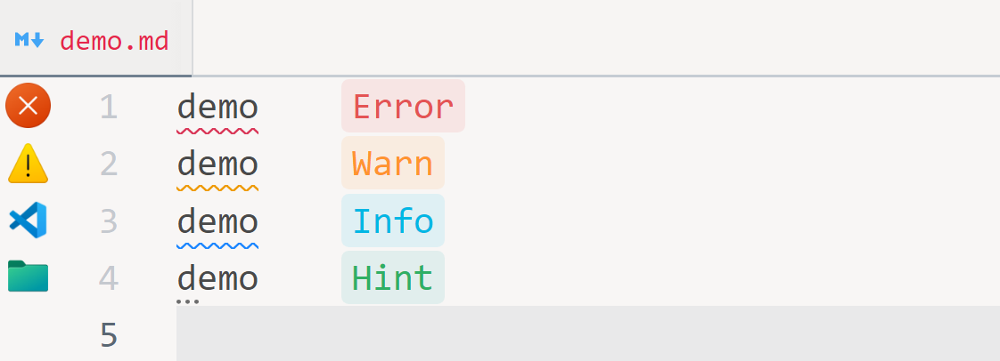

</td>

</tr>
</tbody>
</table>

### `errorLens.warningGutterIconPath`

Same as [errorLens.errorGutterIconPath](#errorlenserrorguttericonpath)

### `errorLens.infoGutterIconPath`

Same as [errorLens.errorGutterIconPath](#errorlenserrorguttericonpath)

### `errorLens.hintGutterIconPath`

Same as [errorLens.errorGutterIconPath](#errorlenserrorguttericonpath)

### `errorLens.errorGutterIconColor`

Change color of gutter icons (for shapes and letters).

<table>
<tbody>

<tr>
<td>

```js
"errorLens.gutterIconSet": "squareRounded",
"errorLens.errorGutterIconColor": "#6a54e4",
"errorLens.warningGutterIconColor": "#29d8ff",
"errorLens.infoGutterIconColor": "#21d439",
"errorLens.hintGutterIconColor": "#b5a7b0",
```

</td>
<td>

```js
"errorLens.gutterIconSet": "letter",
"errorLens.errorGutterIconColor": "#6a54e4",
"errorLens.warningGutterIconColor": "#29d8ff",
"errorLens.infoGutterIconColor": "#21d439",
"errorLens.hintGutterIconColor": "#b5a7b0",
```

</td>
</tr>

<tr>
<td>


</td>

<td>

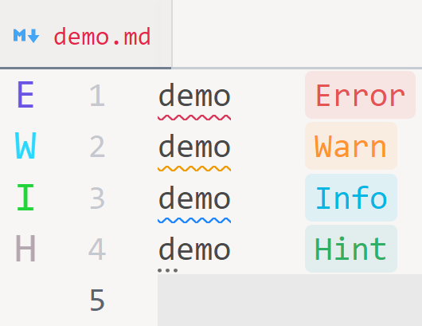

</td>

</tr>
</tbody>
</table>


### `errorLens.warningGutterIconColor`

Same as [errorLens.errorGutterIconPath](#errorlenserrorguttericoncolor)

### `errorLens.infoGutterIconColor`

Same as [errorLens.errorGutterIconPath](#errorlenserrorguttericoncolor)

### `errorLens.hintGutterIconColor`

Same as [errorLens.errorGutterIconPath](#errorlenserrorguttericoncolor)

### `errorLens.removeLinebreaks`

Diagnostic message may contain linebreaks, but inline message decorations are ... inline. This replaces linebreaks (multiple in a row too) with the symbol controlled by [errorLens.replaceLinebreaksSymbol](#errorlensreplacelinebreakssymbol).

### `errorLens.replaceLinebreaksSymbol`

When [errorLens.removeLinebreaks](#errorlensremovelinebreaks) is enabled => replaced linebreaks `\n` with the new symbol that can be represented inline (`⏎` by default).

### `errorLens.scrollbarHackEnabled`

When showing inline message decorations - VSCode also shows horizontal scrollbar that stays even after message is removed. This is a hack that makes inline message to be absolutely positioned `position:absolute;` to not show any scrollbars. It can make the [errorLens.padding](#errorlenspadding) look differently though.

<table>
<tbody>

<tr>
<th>false</th>
<td>

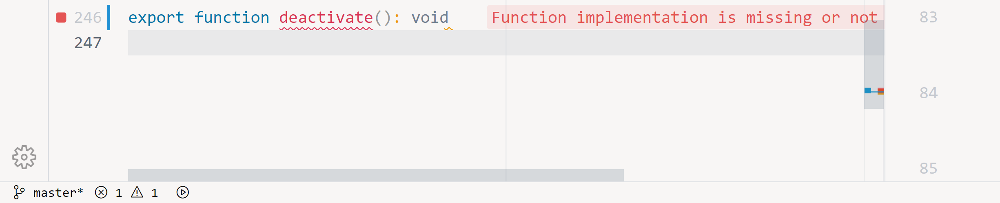

</td>
</tr>

<tr>
<th>true</th>
<td>


</td>

</tr>
</tbody>
</table>

### `errorLens.decorations`

Advanced control over decorations (only problem message & problem range).

<table>
<tbody>

<tr>
<td>

```js
"errorLens.decorations": {
    "errorMessage": {
        "textDecoration": ";background:linear-gradient(to right, #0088ff, #0a9c33);border-radius:0.3em;padding:0 0.5ch;",
        "color": "#fff",
        "fontWeight": "bold",
    },
},
```

</td>
</tr>

<tr>
<td>

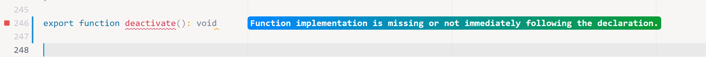

</td>
</tr>

<tr>
<td>

```js
"errorLens.decorations": {
    "errorMessage": {
        "textDecoration": ";border:1.2px dashed #e4545470;text-shadow:1px 1px 2px #e4545470;border-radius:0.3em;padding:0 0.5ch;",
    },
},
```

</td>
</tr>

<tr>
<td>


</td>
</tr>

</tbody>
</table>

### `errorLens.ignoreUntitled`

When enabled - will not show any decorations in files with the file scheme `untitled` (newly created unsaved files).

### `errorLens.ignoreDirty`

When enabled - will not show any decorations on Dirty (modified) files.

### `errorLens.codeLensEnabled`

Show messages as insets between the lines.

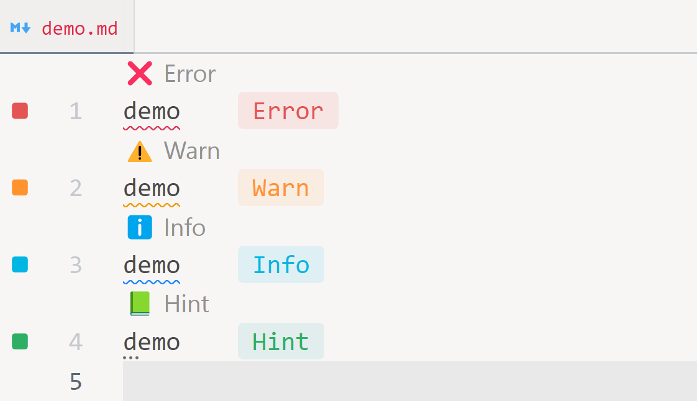

### `errorLens.codeLensLength`

Enforce minimum and maximum length of code lens messages.

### `errorLens.codeLensTemplate`

Almost the same as [errorLens.messageTemplate](#errorlensmessagetemplate), but for the Code Lens feature.

### `errorLens.codeLensOnClick`

Code Lens is clickable. This setting configures what happens when you click on Code Lens message:

- `none` => does nothing
- `showProblemsView` => Open VSCode built-in `Problems` view (runs `workbench.actions.view.problems`)
- `showQuickFix` => Open Quick Fix menu (runs `editor.action.quickFix`)
- `searchForProblem` => Search for problem message in your default browser (runs `errorLens.searchForProblem`)

---

## Custom CSS

Status bar messages can be hard to read, so I'm using [Custom CSS](https://marketplace.visualstudio.com/items?itemName=be5invis.vscode-custom-css) to change the `font-size` of the status bar items:

```css
/* ──── StatusBar ───────────────────────────────────────────── */
.statusbar {
    /* Monospace font and emoji fallback */
	font-family: Menlo, Monaco, Consolas, 'Droid Sans Mono', 'Courier New', monospace, 'Apple Color Emoji', 'Segoe UI Emoji', 'Noto Color Emoji' !important;
	font-size: 14px !important;/* 12px => 14px */
}

.monaco-workbench .part.statusbar > .items-container > .statusbar-item {
	max-width: 70vw !important;/* 40% => 70% Viewport width */
}

.monaco-workbench .part.statusbar > .items-container > .statusbar-item > :first-child {
	margin-left: 0 !important;/* Remove margin (fit more items) */
	margin-right: 0 !important;
}
/* ──────────────────────────────────────────────────────────── */

/* ──── Target only Error Lens status bar items ─────────────── */
/* "errorLens.statusBarMessageEnabled": true, */
#usernamehw\.errorlens\.errorLensMessage {
    font-size: 14px !important;
}

/* "errorLens.statusBarIconsEnabled": true, */
#usernamehw\.errorlens\.errorLensError {}
#usernamehw\.errorlens\.errorLensWarning {}
/* ──────────────────────────────────────────────────────────── */
```

<table>
<tbody>

<tr>
<td>

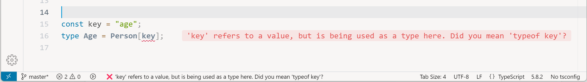

</td>
</tr>

<tr>
<td>

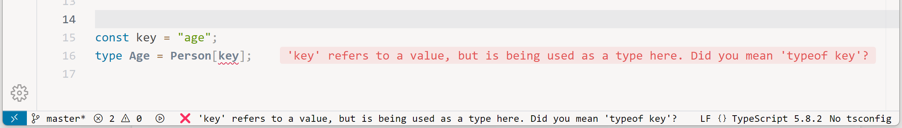

</td>

</tr>
</tbody>
</table>
